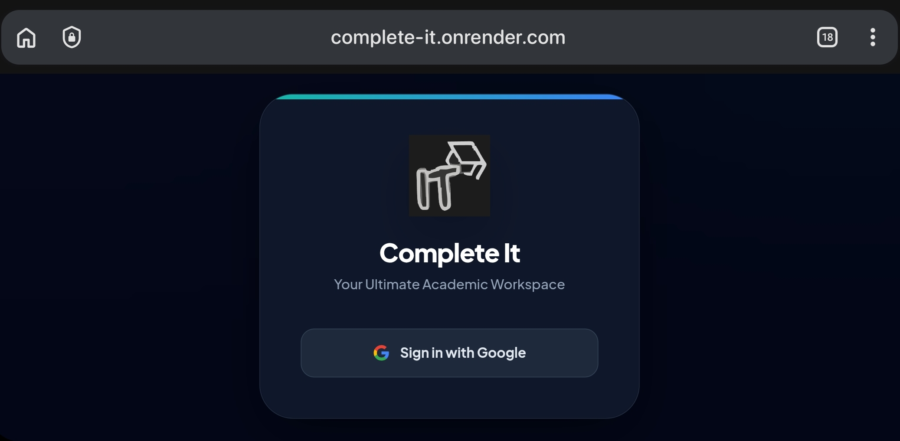
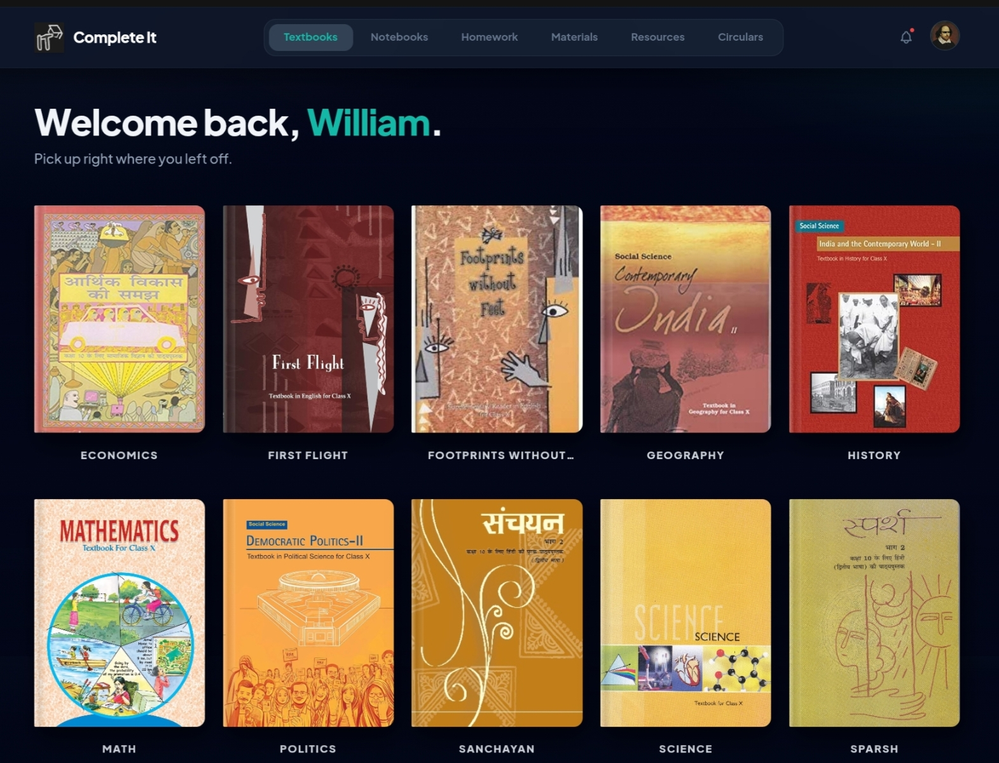
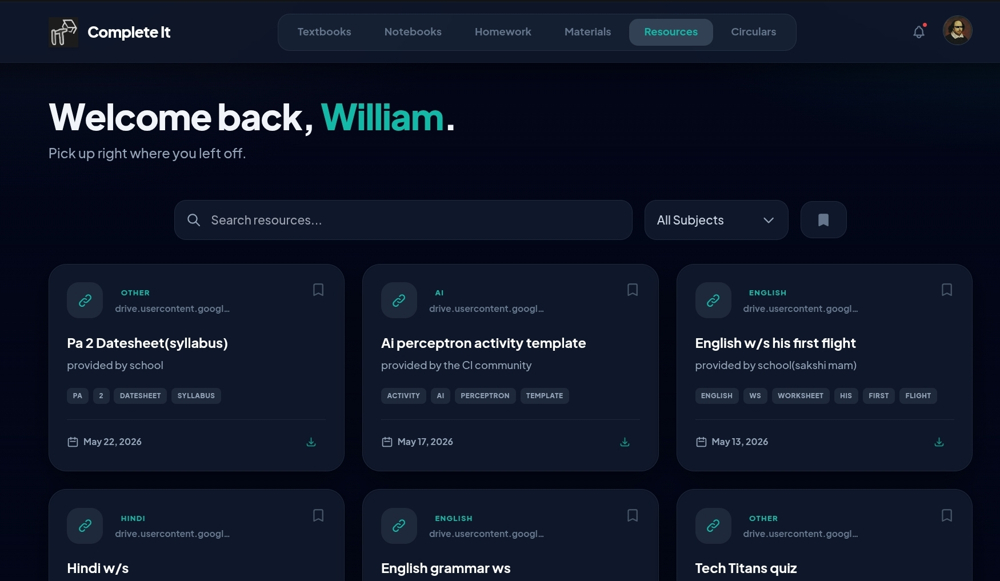
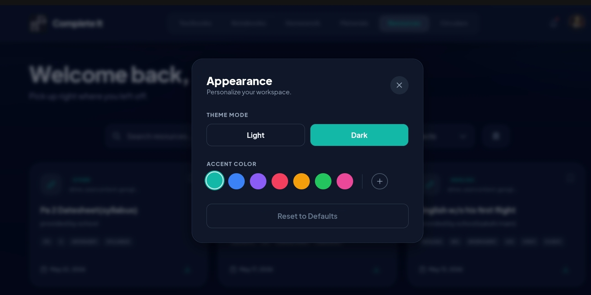

# 📚 Complete It — v2

**A single-page academic workspace built by a student, for students.**

Textbooks, notebooks, homework logs, classroom materials, resources, and school circulars — all in one place, auto-synced, and actually pleasant to use.

---

## The Story

Complete It didn't start as a "project." It started as a problem.

In my class, nobody ever had complete homework or notes — everything was scattered across group chats, shared as blurry phone photos, and updated inconsistently. That gap cost me marks in internal assessments, and I got tired of it.

**v1** was my answer: a single 4,000-line Python monolith. It technically worked — running at a few frames per second, with a UI that could generously be called "functional" — but it was a mess. AI tooling wasn't good enough yet to help me build something polished, and neither was I. I shelved it for six months.

**v2** is the real milestone. It's a full rewrite with:
- Google OAuth login
- Preferences with live accent-color customization
- Bookmarking
- Background workers that auto-scrape homework, classwork, and circulars from the school's Google Classroom and website
- Automatic filtering of fee-related notices out of the circulars feed
- A (mostly) working notification system
- A redesigned brand identity and logo
- An admin panel
- A packaged APK so it could be installed like a native app

More than the tech, v2 had real adoption: **25+ students** actively used and helped shape the platform, one teacher signed up, and for a while an entire grade had a genuinely better way to keep up with school.

The hype has since cooled, so I'm building **v3 (or v2.5)** next — and in the meantime, I'm open-sourcing v2 as-is: warts, wins, and all.

---

## ✨ Features

| Area | What it does |
|---|---|
| **Auth** | Google OAuth 2.0 sign-in, session-token based |
| **Textbooks & Notebooks** | Browsable, cover-thumbnail library grouped by subject |
| **Homework** | Daily class work / homework log with search and history |
| **Classroom Materials** | Auto-synced materials feed from Google Classroom |
| **Resources** | Searchable, filterable, bookmarkable resource library |
| **Circulars** | School circulars feed with fee-related notices filtered out by default |
| **Announcements** | In-app notification dropdown |
| **Preferences** | Light/dark mode + custom accent color, persisted locally |
| **Mobile-first UI** | Responsive layout, bottom-friendly nav, works well as an installed PWA/APK |

---

## 📸 Screenshots

<!-- Drop your screenshots/GIFs in a /screenshots folder in the repo and reference them below -->

| Login | Dashboard |
|---|---|
|  |  |

| Resources | Preferences |
|---|---|
|  |  |

---

## 🛠 Tech Stack

- **Backend:** FastAPI (Python), single-file architecture
- **Database:** Supabase (Postgres)
- **Frontend:** Vanilla JS + Tailwind CSS (via CDN) — no frontend framework
- **Auth:** Google OAuth 2.0

---

## 🚀 Getting Started

### Prerequisites
- Python 3.9+
- A [Supabase](https://supabase.com) project
- A Google Cloud OAuth 2.0 client (Web application)

### 1. Clone and install

```bash
git clone https://github.com/devsoniexpert72/Complete-it-Open-Sourced.git
cd Complete-it-Open-Sourced
pip install -r requirements.txt
```

### 2. Configure environment variables

Create a `.env` file (or set these in your host's environment settings):

```env
SUPABASE_URL=your_supabase_project_url
SUPABASE_KEY=your_supabase_anon_key
```

> ⚠️ Use the **anon/public** Supabase key here, not the service role key. The service role key bypasses Row Level Security and should never be exposed client-side or committed to a repo.

### 3. Add Google OAuth credentials

Download your OAuth client credentials from the [Google Cloud Console](https://console.cloud.google.com) and save them as `credentials.json` in the project root. This file is gitignored — never commit it.

Update `REDIRECT_URI` in the code to match your deployed domain.

### 4. Set up your Supabase tables

You'll need tables for: `users`, `sessions`, `textbooks`, `textbook_thumbnails`, `notebooks`, `homework_logs`, `classroom_materials`, `resources`, `announcements`, `circulars`. (Schema export coming soon — contributions welcome.)

### 5. Run it

```bash
python main.py
```

The app will be available at `http://localhost:10000`.

---

## 🗺 Roadmap

v2 is being preserved here as a milestone release. Active development has moved to **v3**, focused on:
- Cleaner architecture (breaking up the single-file monolith)
- Better notification reliability
- Improved sync performance

---

## 🙏 Acknowledgments

Complete It wouldn't have gone anywhere without the people who used it, broke it, and told me so.

Special thanks to **Yuvraj** and **Ojas** for beta testing and product suggestions.

Thanks to **Yuwal**, **Sinha**, and **Juneja** for feedback and honest critique.

And thank you to every student who trusted this app with their homework, and the one teacher who gave it a shot.

---

## 📄 License

MIT
